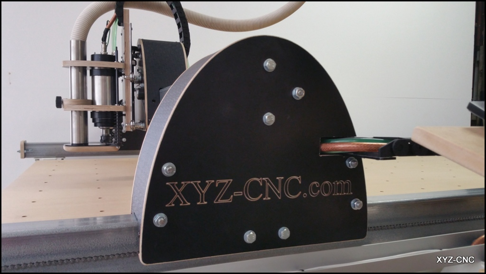

# XYZ-CNC Documentation

> Original XYZ-CNC kit homepage (archived):
> https://web.archive.org/web/20220307203536/https://xyz-cnc.com/

Australian-made CNC router kit, now discontinued. Originally designed and built
in Melbourne by Eugene Vashenko. This repo documents the machine as-built,
including wiring, settings, modifications, and reference material for ongoing
operation and maintenance.

---

## Machine Overview

| Spec | Detail |
|------|--------|
| Machine | XYZ-CNC Router Kit |
| Origin | Melbourne, Australia |
| Acquired | March 2025 |
| Age at acquisition | ~12 years |
| Frame | 100×50×3mm steel tubing |
| Bed size (X × Y) | 2640mm × 1250mm |
| Z travel | 150mm |

### Drive System

| Axis | Drive Type |
|------|-----------|
| X | ¼" pitch roller chain |
| Y | ¼" pitch roller chain |
| Z | T8 Leadscrew |

### Steppers

| Spec | Detail |
|------|--------|
| Model | Wantai 57BYGH633 |
| Size | NEMA23 |
| Step angle | 1.8° (200 steps/rev) |
| Rated current | 3A |
| Holding torque | 13.5 kg·cm |
| Count | 4 (X, Y, Z + A slaved to X for gantry) |

### Controller & Software

| Spec | Detail |
|------|--------|
| Stepper driver | Gecko G540 4-axis |
| Motion controller | Dell OptiPlex 780 parallel port |
| Control software | Mach3 |
| OS | Windows 7 32-bit |
| Microstepping | 10× (G540 fixed) |

### Spindle

| Spec | Detail |
|------|--------|
| Spindle | 80mm water-cooled, 2.2kW |
| Collet | ER20 |
| Max RPM | 24,000 |
| VFD | Huanyang HY02D223B |

---

## Key Settings Quick Reference

| Setting | Value |
|---------|-------|
| X steps/mm | 137.300 |
| Y steps/mm | 137.231 |
| Z steps/mm | 375.000 |
| X/Y velocity | 250 mm/min |
| Z velocity | 83.33 mm/min |
| X/Y acceleration | 750 mm/s² |
| Z acceleration | 500 mm/s² |
| Spindle PWM frequency | 900 Hz |
| Power supply voltage | 40.5V (48V supply, set down) |

> Full motor tuning and pin assignments in [Mach3/README.md](./Mach3/)

---

## Contents

- [Wiring](./Wiring/) — control box wiring, Gecko G540 pin assignments, spindle,
  limit switches
- [Mach3](./Mach3/) — motor tuning, port & pin settings, profile XML backup
- [Manuals](./Manuals/) — VFD manual, Gecko G540 manual
- [Upgrades](./Upgrades/) — completed modifications and planned improvements
